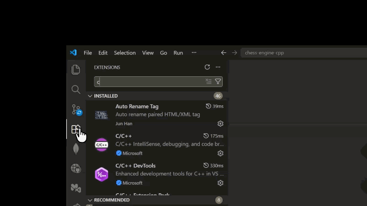

<div align="center">


<h3>Chanakya</h3>

<p>
  A Open Source lightweight <strong>chess engine</strong> written in C++
</p>

<p align="center">
  <a href="https://marketplace.visualstudio.com/items?itemName=mrcodium.chess-engine">
    
  </a>
</p>

<p align="center">
  <a href="https://github.com/abhijeetSinghRajput/chanakya">
    
  </a>
</p>
<p align="center">
  
  
  
  
</p>




</div>

<details>
<summary>Table of Contents</summary>

- [About](#about)
- [Features](#features)
- [Installation](#installation)
- [Engine Strength](#engine-strength)
- [Supported Commands](#supported-commands)
- [Development](#development)
- [Contributing](#contributing)
- [License](#license)

</details>

---

# About

**Chanakya** is a lightweight chess engine written in modern C++ that fully
implements the **UCI protocol**.

It supports custom **FEN positions**, **Polyglot opening books**, configurable
search depth and time controls, and ships with a dedicated **Visual Studio Code
extension** for playing and analyzing games directly inside your editor.

The engine is designed to be simple, fast, and easy to integrate into chess
GUIs and tooling.

---

# Features

- Full **UCI protocol** support
- Supports `startpos` and arbitrary **FEN** positions
- Adjustable **search depth** and **time controls**
- Polyglot **opening book** support
- Undo support (`undo`)
- Board visualization (`d`)
- Manual move testing (`move`)
- Dedicated **VS Code GUI**
- Lightweight modern C++ implementation

---

# Installation

Chanakya can be used in two ways:

- Through the VS Code extension (recommended)
- Directly from the command line

---

## Option 1: VS Code Extension

### Install from Marketplace

Install the official VS Code extension to play and analyze games directly inside your editor.

<a href="https://marketplace.visualstudio.com/items?itemName=mrcodium.chess-engine">
  
</a>

### Steps

1. Open VS Code.
2. Open the Extensions panel (`Ctrl+Shift+X`).
3. Search for **Chanakya Chess Engine**.
4. Click **Install**.
5. Open the extension and start playing.

---

## Option 2: Build from Source (CLI)

Clone the repository:

```bash
git clone https://github.com/abhijeetSinghRajput/chess-engine-cpp.git
```

Enter the project directory:

```bash
cd chess-engine-cpp
```

Build the engine:

```bash
make
```

Run the engine:

### Linux / macOS

```bash
./chanakya
```

### Windows

```bash
chanakya.exe
```

### Test the engine

```text
uci
isready
position startpos
go depth 10
```

---

# Engine Strength

Chanakya has been benchmarked at approximately:

<div align="center">

## ⭐ 2326 Elo ± 16

**827 games · 60+0.6 time control**

</div>

using `cutechess-cli` and Ordo's Bayesian anchored rating calculation against
**Stockfish 18** throttled to **2300** and **2400 Elo**.

| Metric | Value |
| ------- | ------- |
| Rating | **2325.8 Elo** |
| Error margin (95% CI) | **± 16.1** |
| Games played | **827** |
| Opponents | **Stockfish 18 @ 2300 / 2400 Elo** |
| Time control | **60+0.6** |
| Rating method | **Ordo Bayesian estimation** |

### Methodology

- Ratings are relative to Stockfish's `UCI_LimitStrength`.
- Chanakya's internal opening book was disabled.
- Both engines used a shared randomized opening book.
- Time-forfeit games from an earlier build were excluded.
- This is **not** an official CCRL or CEGT rating.

---

# Supported Commands

| Command | Description |
|----------|----------|
| `uci` | Initialize UCI mode |
| `isready` | Check readiness |
| `position startpos` | Load starting position |
| `position fen ...` | Load custom FEN |
| `go depth N` | Search to depth |
| `go movetime N` | Search for milliseconds |
| `move e2e4` | Make a move |
| `undo` | Undo last move |
| `d` | Print board |

---

# Development

```bash
make
./chanakya
```

Example:

```bash
uci
isready
position startpos
go depth 10
```

---

# Contributing

Contributions are always welcome.

1. Fork the repository.
2. Create a feature branch.
3. Commit your changes.
4. Push the branch.
5. Open a pull request.

Please open an issue first if you'd like to discuss major changes.

---

# License

Released under the **GPL-3.0 License**.
