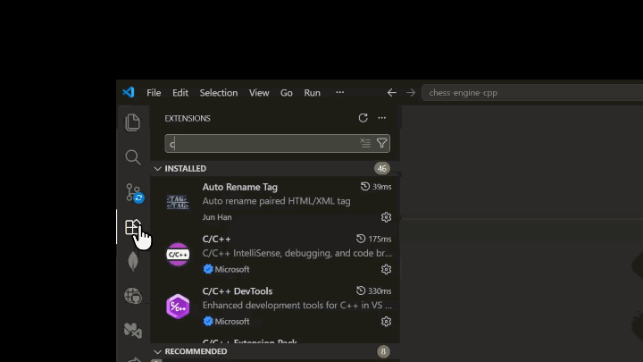

<div align="center">

  

  <h3>Chanakya (~2500 ELO)</h3>

  <p>
    A Open Source lightweight <strong>chess engine</strong> written in C++
  </p>

  <p align="center">
    <a href="https://github.com/abhijeetSinghRajput/chanakya">
      
    </a>
  </p>
  <p align="center">
    
    
    
    
  </p>

  <br>
  <br>

  <p align="center">
    <a href="https://marketplace.visualstudio.com/items?itemName=mrcodium.chess-engine">
      
    </a>
  </p>

  <p align="center">
    Test the engine on
    <a href="https://marketplace.visualstudio.com/items?itemName=mrcodium.chess-engine">GUI</a>
  </p>

  
</div>

## Table of Contents

- [Features](#features)
- [Installation](#installation)
- [Engine Strength](#engine-strength)
- [Supported Commands](#supported-commands)
- [What You Can Contribute](#what-you-can-contribute)
- [PR Merge Policy](#pr-merge-policy)
- [Thanks and Acknowledgements](#thanks-and-acknowledgements)
- [License](#license)

## Features

**Core**
- Bitboar + Bit magic
- Zobrist hashing
- Transposition Table
- UCI Protocol

**Search**
- Alpha-beta
- Reverse futility
- Null move prunning
- Late move reduction (LMR)
- Killer moves (2 per ply)
- Countermove heuristic
- History Heuristic + aging

**Evaluation**
- Piece square table
- Mobility
- Pawn Structure (isolated, passed, doubled, support)
- Rook-bonus (open file, 7th rank)
- Bishop pair
- King Safety (pawn shield, storm, zone attacks)

## Installation 

**Option 1: VS Code Extension**

<a href="https://marketplace.visualstudio.com/items?itemName=mrcodium.chess-engine">
  
</a>

<br>
<br>

**Option 2: Build from Source (CLI)**

```bash
git clone https://github.com/abhijeetSinghRajput/chess-engine-cpp.git
cd chess-engine-cpp
make
```

## Engine Strength

Chanakya has been benchmarked at approximately:

**⭐ ~2499 Elo (± 20.6)** — 1000 games, 60+0.6 time control, using
cutechess-cli and Ordo's Bayesian anchored rating calculation against
Stockfish 18 throttled to 2500 Elo.

| Metric | Value |
|--------|-------|
| Rating | **2499 Elo** |
| Error margin (95% CI) | ± 20.6 |
| Games played | 1,000 |
| Opponent | Stockfish 18 @ 2500 Elo |
| Time control | 60+0.6 |
| Rating method | Ordo Bayesian estimation |

White advantage = 41.20 ± 10.68 &nbsp;·&nbsp; Draw rate (equal opponents) = 4.94% ± 0.70


## Supported Commands

**Custom Commands**

| Command | Description |
|---------|-------------|
| `move e2e4` | Make a move on the current position. |
| `undo` | Undo the last move. |
| `d` | Print the current board. |

**UCI Options**

| Option | Type | Default | Description |
|--------|------|---------|-------------|
| `Hash` | Spin | `16` MB | Size of the transposition table. |
| `UseBook` | Check | `false` | Enable or disable the Polyglot opening book. |

## What You Can Contribute

Contributions are always welcome — from a one-line eval tweak to a full
search feature. This section is a living map of what's genuinely useful to 
work on next. Please open an issue first if you'd like to discuss a major 
change before writing code.

**Workflow:** fork → feature branch → commit → push → open a PR. See
[PR Merge Policy](#pr-merge-policy) below for how changes get accepted.


Everything below is confirmed **not yet implemented** — no partial/half-done
code to work around, just a clean slot to fill.

**1. Search**

| Feature | Expected Impact |
|---|---|
| Principal Variation Search (PVS) | 15–20% speedup |
| Aspiration Windows | 10–15% speedup |
| SEE (Static Exchange Evaluation) | Better move ordering |
| Internal Iterative Deepening (IID) | Better move ordering at depth |
| Razor Pruning | 5–10% speedup |
| Futility Pruning (forward) | 5–10% speedup |
| Singular Extensions | Position-specific improvements |
| Mate Distance Pruning | Faster mate detection |
| Multi-Cut Pruning | Aggressive pruning at higher depths |

**2. Transposition Table**

| Feature | Expected Impact |
|---|---|
| TT Prefetching | 5–10% NPS increase |
| TT Probing in Quiescence | Reduce quiescence work |
| TT Hit Statistics | Tuning/debugging visibility |
| 2-Entry TT Slots | Better replacement behavior |

**3. Evaluation**

| Feature | Expected Impact |
|---|---|
| Texel / SPSA Tuning Framework | Optimize all PSTs and constants at once |
| Tapered (phase-interpolated) Eval | Smoother midgame→endgame transition |
| Connected Passed Pawns | Stronger endgame play |
| King Tropism | Better king safety |
| Outpost Squares | Better piece placement |
| Pawn Chains / Backward Pawns | Pawn-structure refinement |
| Trapped Piece Penalty | Avoid bad trades |
| Space Advantage | Positional control |
| King Activity (endgame) | Better king usage in the endgame |
| Bishop-Pair Opposite-Color Check | More accurate bishop-pair bonus |
| Endgame Opposition | Pawn endgame precision |

**4. Move Ordering & Generation**

| Feature | Expected Impact |
|---|---|
| SEE in Move Ordering | Better capture ordering |
| Killer / History / Countermove Tuning | More effective move ordering |
| Pawn Push Ordering | Minor improvement |

**5. UCI & Engine Features**

| Feature | Expected Impact |
|---|---|
| Fuller UCI Compliance | Wider GUI compatibility |
| Better Time Management | Fewer flags, better clock usage |
| Multi-Threading (Lazy SMP) | 2–3x speedup on multi-core |
| Syzygy Tablebase Support | Perfect endgame play |
| Opening Book Selection | Better/varied opening play |
| Benchmark Mode | Standardized performance testing |

**Suggested priority order**, if you're not sure where to start:
1. PVS + Aspiration Windows
2. SEE
3. Tapered evaluation
4. Lazy SMP (4 cores)
5. TT improvements (prefetch, quiescence probing)

## PR Merge Policy

**A PR is only merged if it's measurably better than the current version.**
"Better" is decided by self-play testing on the same hardware and the same
engine options, not by code review alone — a plausible-sounding idea that
doesn't hold up in an SPRT gets rejected just as fast as an unplausible one.

**Testing setup:** [cutechess-cli](https://github.com/cutechess/cutechess),
same machine, same `Hash`/thread settings for both sides, at all three of:

```
60+0.6
30+0.3
15+0.15
```

**Draw/resign adjudication** (used in every test match so games don't drag
on pointlessly):

```powershell
"-draw", "movenumber=80", "movecount=8", "score=5",
"-resign", "movecount=3", "score=600"
```

**Example overnight run** (candidate build vs. a Stockfish anchor — adapt
paths/engine names for a build-vs-build test):

```powershell
# =========================================================
# Chanakya Selfplay Test
# =========================================================

$CUTECHESS = "C:\path\to\cutechess-cli.exe"
$CHANAKYA  = "C:\path\to\chanakya.exe"
$CHANAKYA_new = "C:\path\to\chanakya_new.exe"
$BOOK      = "C:\path\to\8moves_v3.pgn"

$TC = "60+0.6"
$CONCURRENCY = 4

$matchArgs = @(
    "-engine", "cmd=$CHANAKYA", "name=Chanakya", "option.Hash=128", "option.usebook=false",
    "-engine", "cmd=$CHANAKYA_new", "name=Chanakya-New", "option.Hash=128", "option.usebook=false",
    "-each", "proto=uci", "tc=$TC",
    "-openings", "file=$BOOK", "format=pgn", "order=random", "plies=16",
    "-rounds", "500",
    "-repeat",
    "-games", "2",
    "-concurrency", "$CONCURRENCY",
    "-pgnout", "chanakya_selfplay.pgn",
    "-ratinginterval", "10",
    "-recover",
    "-maxmoves", "200",
    "-draw", "movenumber=80", "movecount=8", "score=5",
    "-resign", "movecount=3", "score=600"
)

& $CUTECHESS $matchArgs 2>&1 | Tee-Object -FilePath "chanakya_selfplay.txt"

# Rate the result:
# .\ordo.exe -a 2500 -A "SF-2500" -p chanakya_selfplay.pgn -o chanakya_selfplay_rating.txt -W -s 1000 -D
```

If you're proposing a search or eval change, run your build against the
current `main` at all three time controls above (build-vs-build, not vs.
Stockfish) and include the SPRT/Ordo result in your PR description. Small,
isolated changes are much easier to validate — and much easier to merge —
than a PR that bundles five ideas at once.

## Thanks and Acknowledgements

Chanakya wouldn't exist without the chess programming community's tradition of teaching in public. Special thanks to:

- **[Sebastian Lague](https://www.youtube.com/watch?v=U4ogK0MIzqk)** — Inspired me to build my first chess engine.
- **[Harvard CS50's AI with Python](https://www.youtube.com/watch?v=5NgNicANyqM)** — Introduced me to minimax and adversarial search through Tic-Tac-Toe.
- **[VICE](https://www.youtube.com/playlist?list=PLZ1QII7yudbc-Ky058TEaOstZHVbT-2hg)** (Bluefever Software) — Taught the fundamentals of board representation, move generation, and search.
- **[BBC](https://www.youtube.com/playlist?list=PLmN0neTso3Jxh8ZIylk74JpwfiWNI76Cs)** (Bit-Board Chess, by Code Monkey King) — Introduced bitboards, magic bitboards, and efficient attack generation.
- **[cutechess](https://github.com/cutechess/cutechess)** — Used for engine testing, self-play, and benchmark matches.
- **[Ordo](https://github.com/michiguel/Ordo)** — Used to estimate Elo ratings from match results using Bayesian methods.

## License

Released under the [GPL-3.0 License](LICENSE).
